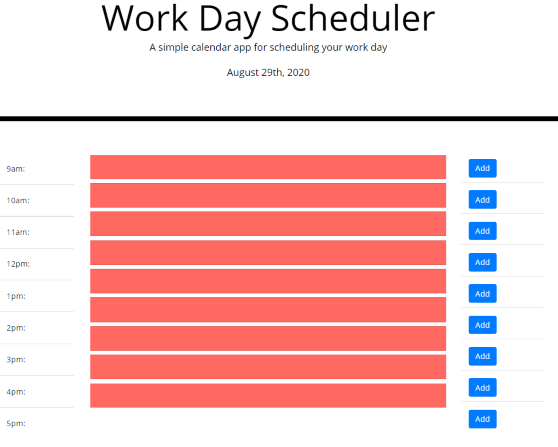
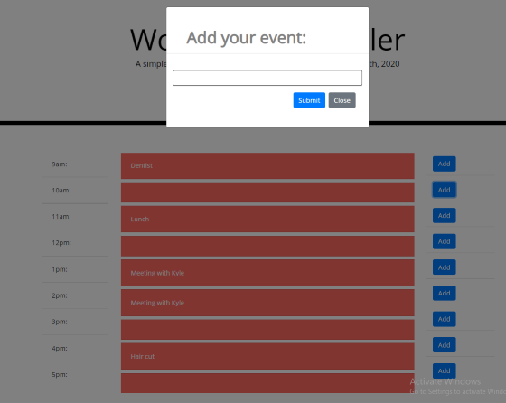

# WORK DAY SCHEDULER

This web app is designed to allow user's to input their daily work schedule to help keep track of their day.

## FUNCTIONALITY
*   Add calender events daily through the use of bootstrap modals

* Time tracking used to highlight timeslots depending on whether the event has passed, current, or upcoming.
* Responsive design to accomodate, desktop, mobile, and tablet views

## Download
Source code for this project can be found at: 
